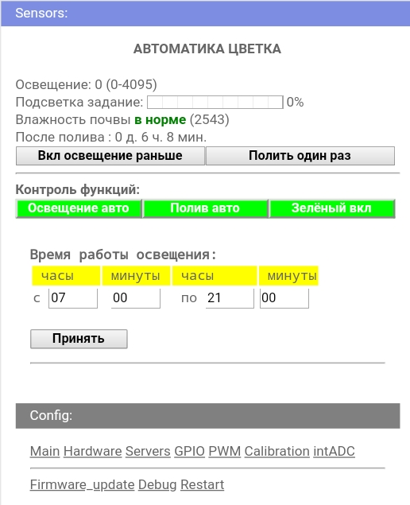

# Flower
Проект Цветок.
Разработан для ESP32 и конструктора прошивок wifi-iot.com

1) Управляет мощностью подсветки в зависимости от недостатка освещения.
2) Поливает цветок при маленькой влажности почвы. 
2.1) Добавлена защита от помех на датчике влажности ввиде обязательного
срабатывания датчика два раза подряд. Изменение срабатывает один раз в минуту. 
2.2) Добавлена защита от неправильной установки датчика влажности или
если его вытащили из земли. Срабатывает на превышение защитной уставки. 
2.3) Добавлена задержка между поливами. Для учёта времени распространения
влаги в земле. 
2.4) Реализовано ограничение времени полива временем работы подсветки.
Чтобы насос не жужал ночью. 
3) Защищает насос от сухого хода. Путём измерения уровня в баке с водой.
4) Устанавливает период работы подсветки и полива.
5) Имеется возможность выключения зелёного цвета для экономии электричества.
(Растениям зелёный цвет не нужен, но без него цветок будет выглядеть плохо)
6) Имеется возможность отключения полива.
7) Имеется возможность отключения подсветки.
8) Имеется возможность инвертирования управления ШИМом.
9) Добавлена кнопка ручного полива.
10) Добавлена кнопка включения подсветки заранее. Если проснулся раньше
и свет уже не помешает. После срабатывания начала автоматической подсветки,
кнопка деактивируется. 

Всё управление и контроль устройством через WEB-интерфейс.

Перефирия: датчик освещённости TEMT6000; ёмкостной датчик влажности почвы;
попловковый датчик уровня; насос; светодиодная RGB лента и RGB amplifer.
Управление силовыми цепями через оптопары!

В конструкторе прошивок используются опции:Внутренние ADC (АЦП); Время и NTP; 
Датчики GET запросом; GPIO; Аппаратный PWM (ШИМ);
Конструктор кода; Конструктор main page.

В конструкторе main page содержимое файла main_page.

В конструкторе кода содержимое файла flower.c.
Настройки конструктора кода в коментариях файла flower.c.

ЗЫ: алгоритмы и код переодически дорабатываются ввиду накопления опыта
использования...
