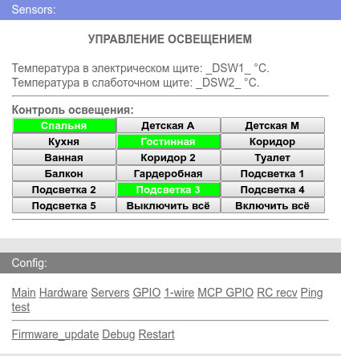

# LightInHome
Проект "Управление освещением в квартире".
Разработан для ESP8266 и конструктора прошивок wifi-iot.com
Актуально для новой разводки проводов в квартире.
Когда на каждую комнату идёт отдельный кабель для освещения.

1) Централизованно из эл. щита управляет освещением от выключателей на 433 МГц.
2) Передаёт на сервер МажерДомо или NodeRed последний принятый код от выключателя,
   а так же состояние всех 16-и GPIO на управляемом расширителе портов MCP23017.
3) Можно из МажерДомо или NodeRed управлять освещением.
4) В веб-интерфейсе доступны все 16 каналов для управления.
5) При потере связи с роутером, ESP8266 поднимает собственную точку доступа
   и после востановления связи отключает её.
6) Подключенны 2 датчика температуры для контроля температуры в эл. щите и слаботочном щите.
 

Перефирия: приёмник на 433 МГц; датчики DS18B20; расширитель портов MCP23017;
модули с твёрдотельными реле.

В конструкторе прошивок используются опции: 1-wire DS18B20 (указать сколько будет датчиков до компиляции); 
MajorDoMo и другие (указать путь и порт на вашем сервере до компиляции); Ping тест (должна быть настроена 
на IP вашего роутера); GPIO MCP23017 (если теребуется инверсия портов, настроить до компиляции); 
RCswitch приёмник 433/315 (настроить на использование 16-и кнопок до компиляции); GPIO; Обновление OTA; 
Auto OTA; Конструктор кода; Конструктор main page.

В конструкторе main page содержимое файла main_page.
В конструкторе кода содержимое файла KK.c, а в настройках
требуется указать что будет использоваться две глобальные переменные.

