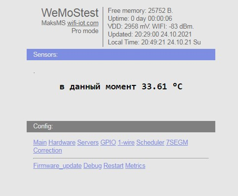
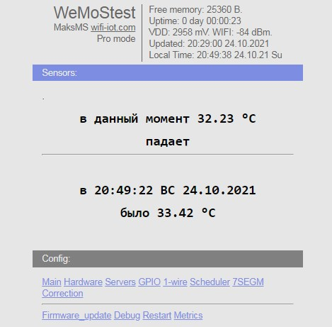
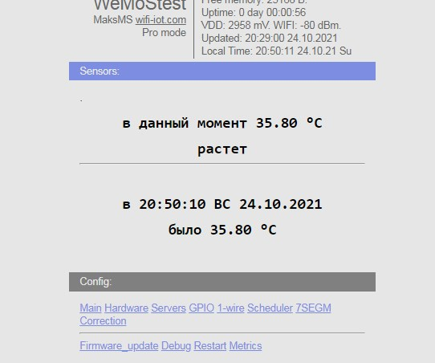
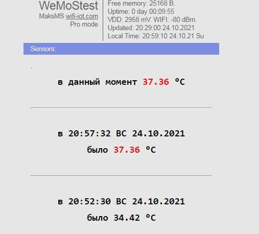
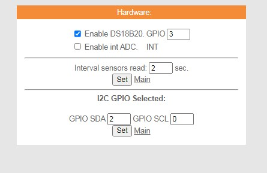
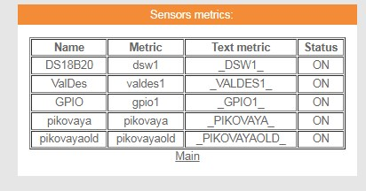
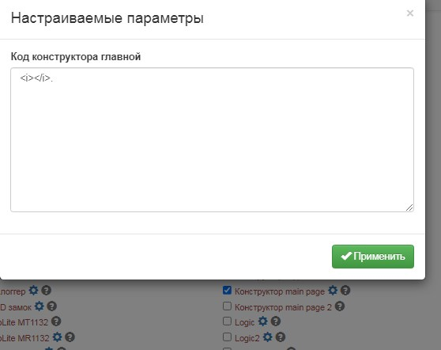
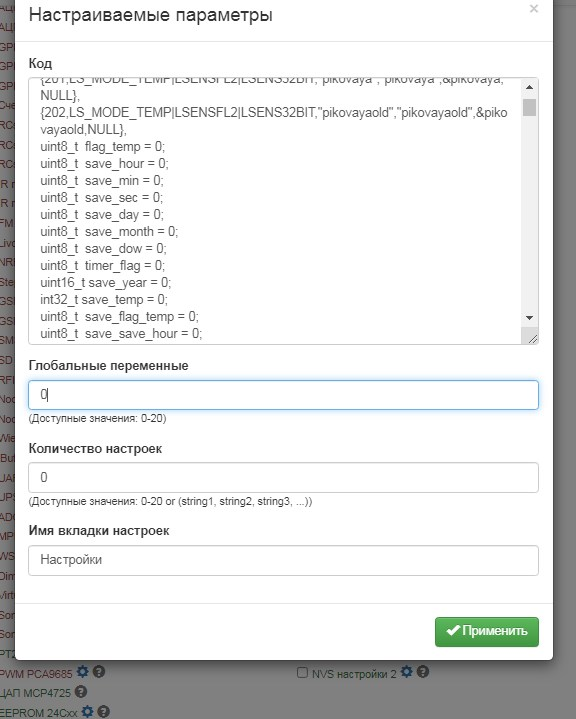

termometr logger
===========

датчик ds18b20 в качестве замера температуры тела

корректировал по ртутному, но незначительно

набираетсЯ температура вначале быстро потом приходитсЯ подержать, но это к конструктиву теплосьема

зато падает быстро, лог приделал из-за этого, чтоб не терЯть пик

пиковые вывел отдельно в свои метрики, можно смотреть через внешние сервисы

код не компактил, чтобы можно было разобратьсЯ без комментированиЯ, мне сейчас не до них (covid)
