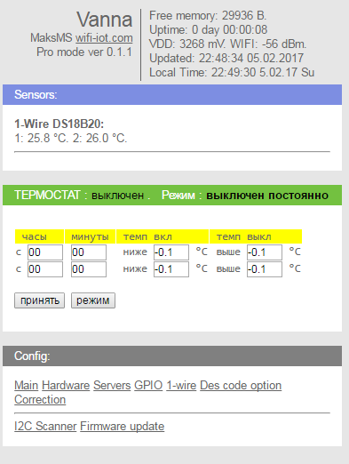

Thermostat
==========

Модуль для Конструктора Кода в проекте WiFi-IoT.com

Термостат.

От время в первой строке (час,мин)до время во второй строке(час,мин) 
если температура упадет ниже темп вкл, то включит гпио, 
если будет выше чем темп выкл то выключит.
Когда наступит время указанное во второй строке будет поддерживать температуру указанную в окошках второй строки.
Кнопка режим переключает режимы последовательно : всегда гпио выключенно ,
холодостат(обратная логика термостату) , термостат , гпио выход всегда включен.

Сделана задержка на обрывы датчика мелкие,до минуты ,чтоб не дергать котел или насос на переодические обрывы датчиков,
помнит значение перед обрывом.Ошибки это 0,+85,+255 градусов.

Датчик ds18b20 dsw1 ,можно изменить на другой в 16 строке.
Выход гпио 16,можно изменить в 8 строке.
