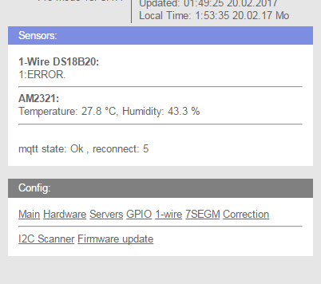
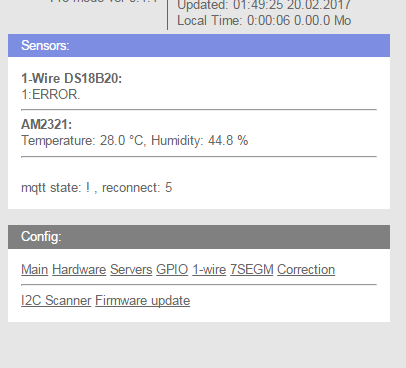

Restart fallen mqtt
===================

Модуль для Конструктора Кода в проекте WiFi-IoT.com

Автоматический рестарт по упавшему мктт.

если в ip/debug MQTT IP: 192.81.221.198 (State: 15 / Errors: 0/0) не 15 или реконектов вифи больше 1000 то рестарт , проверка через первые 5 минут и каждые последующие 5 минут

 
