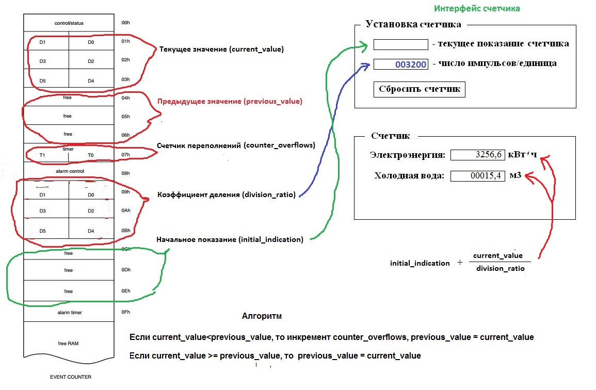

Hardware PCF8583
==================

 Расширение возможностей счетчика импульсов PCF8583.
 
 Аппаратно регистры счетчика могут хранить значение 999999 импульсов, что оказывается мало при подсчете потребляемой электроэнергии, например электросчетчик "Меркурий" формирует 3200 импульсов на 1 кВт. 
 Данный код позволяет задействовать имеющиеся в наличии свободные регистры для хранения дополнительных значений и результатов промежуточных вычислений.
 Так, например расширение счетных возможностей позволяет увеличить число подсчитанных импульсов до 255*999999=254999745, т.е. 254  миллиона!
 

