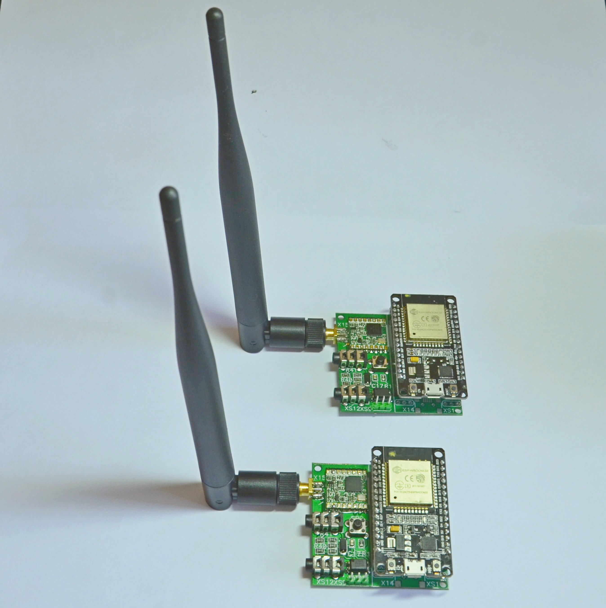
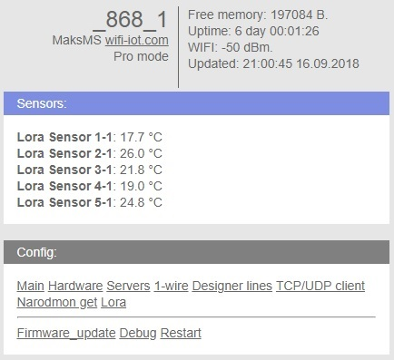
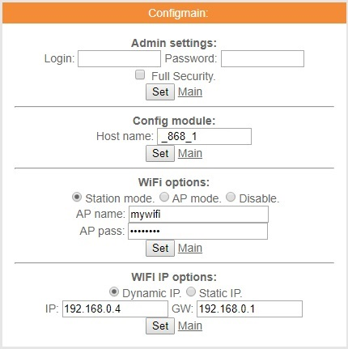
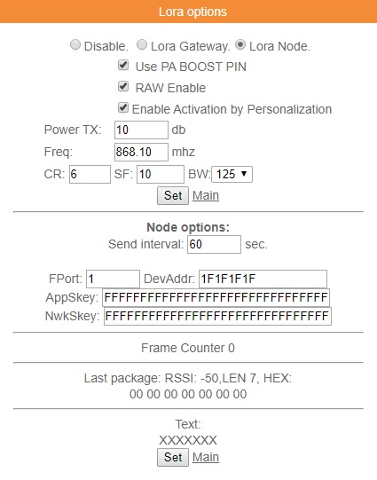
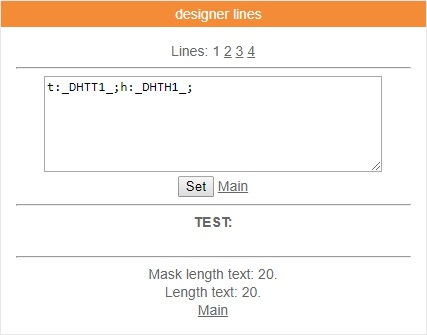

Беспроводной датчик температуры 868МГц (LoRa-модуль RFM95 + ESP32 Node MCU)
=============================================================
Здесь представлен проект беспроводного устройства измерения температуры и влажности на основе LoRa-модуля RFM95 и платы ESP32 Node MCU.

Отличительной особенностью применения радиомодулей RFM95 является существенное увеличение дальности передачи радиопакетов за счет расширения спектра передаваемого сигнала (запатентованная модуляция LoRa). Дальность передачи может достигать 1-3 км в городской застройке и более 4-5 км на открытой местности.

Функциональная схема беспроводного устройства представлена ниже:

В состав устройства помимо названных модулей входит датчик атмосферного давления BMP180, схема преобразования логических уровней 5В <--> 3,3В для подключения внешних датчиков DS18B20 и AM2302, один оптоизолированный цифровой вход и кнопка для перевода устройства в режим настройки. 

Внешний вид печатной платы представлен на рисунках:

Необходимые для производства плат gerber-файлы и файл сверловки отверстий можно скачать [тут](https://github.com/maksms/wifi-iot-cda/blob/master/rapid/lora/ESP32_RFM95V2.rar) 

Заказать изготовление плат можно например на сайте [www.jlcpcb.com](http://www.jlcpcb.com)

Монтаж радиоэлементов выполнять по следующему чертежу:

В результате получим вот такие устройства:

Шлюз работает под управлением популярной в сети Internet прошивки от wifi-iot.com.

Для того, чтобы получить доступ к модулю для его настройки необходимо обеспечить соединение с ним по беспроводному интерфейсу Wi-Fi.

Для этого необходимо перед подачей питания нажать микрокнопку. 
Затем, не отпуская кнопку, подать питание и удерживать нажатой  не менее 3…5 секунд.

Модуль загрузится и перейдет в safe mode режим, станет точкой доступа (AP) незащищенной Wi-Fi сети WiFi-IoT.

Выполняем подключение к сети WiFi-IoT с помощью ноутбука, планшета или телефона с Wi-Fi модулем, в адресной строке браузера набираем IP-адрес модуля 192.168.4.1, после чего отобразится главное меню следующего вида:

Рисунок 4 Главное меню

Для того, чтобы шлюз работал в Вашей домашней беспроводной сети, необходимо выполнить настройки подключения, перейдя на вкладку Config: -> Main, указав имя сети AP name и пароль AP pass:

Рисунок 5 Вкладка Main

Применить настройки нажатием кнопки Set.

Для работы устройства в режиме конечного утройства на вкладке Lora options выполняем следующие настройки:

устанавливаем режим Lora Node (радиокнопка);

устанавливаем галочки: Use PA BOOST PIN, RAW Enable, Enable Activation by Personalization

в окне Power TX значение dBm, из диапазона: 3…14

в окне Freq значение Mhz из набора: 868.9, 869.1, 864.1, 864.3, 864.5, 864.7, 864.9 (план RU868)

в окне CR: 6

в окне SF значение из набора: 7, 8, 9, 10, 11, 12

в окне BW значение из набора: 125, 250 или 500

в окне Send interval желаемый период отправки сообщений на шлюз

в окне FPort: 1

в окне DevAddr любое 4-х байтовое значение (такое же значение указать в настройках шлюза)

в окне AppSkey: FFFFFFFFFFFFFFFFFFFFFFFFFFFFFFFF

в окне NwkSkey: FFFFFFFFFFFFFFFFFFFFFFFFFFFFFFFF

Рисунок 6 Вкладка Lora options

Применить настройки нажатием кнопки Set.

Выбор показаний датчиков для передачи на шлюз осуществляется путем настройки вкладки designer lines:
если подключен датчик DHT22, AM2302, то в поле внести запись: t:_DHTT1_;h:_DHTH1_;
если подключен датчик DST-1, DST-2 (ds18b20)то в поле внести запись: t:_DSW1_;

Рисунок 7 Вкладка designer lines

Применить настройки нажатием кнопки Set.

