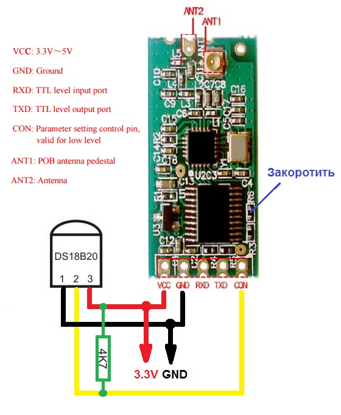
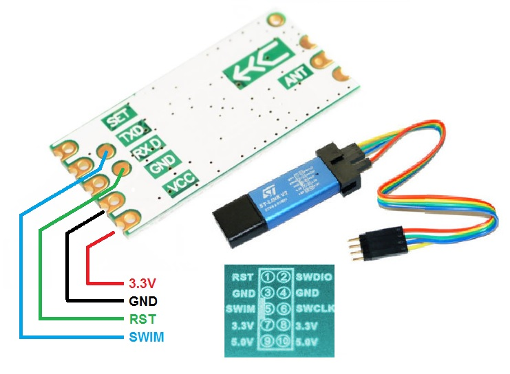

Беспроводной датчик температуры (радиомодуль HC-11 + DS18B20)
=============================================================

Представлена реализация беспроводного датчика температуры на основе радиомодуля HC-11 и широко известной микросхемы DS18B20.
В состав модуля HC-11 входит: приемопередатчик CC1101 со схемой обвязки на частоту 433МГц и 8-разрядный микроконтроллер STM8S003F3P6.
Микросхема CC1101 настраивается для работы в режиме модуляции OOK, что позволяет отправлять радиопакеты изменением порта микросхемы, реализуя [алгоритм передачи данных](http://www.homes-smart.ru/index.php/oborudovanie/bez-provodov-433-315mgts/45-odin-iz-algoritmov-peredachi-dannykh-v-vide-tsifrovogo-koda ).

Для компиляции проекта потребуется [установить STVD + COSMIC](http://www.count-zero.ru/2016/stm8_spl_cosmic/)

Схема подключения датчика температуры DS18B20 к модулю HC-11 выглядит:

Схема подключения программатора ST-LINK V2 для прошивки по интерфейсу SWIM

